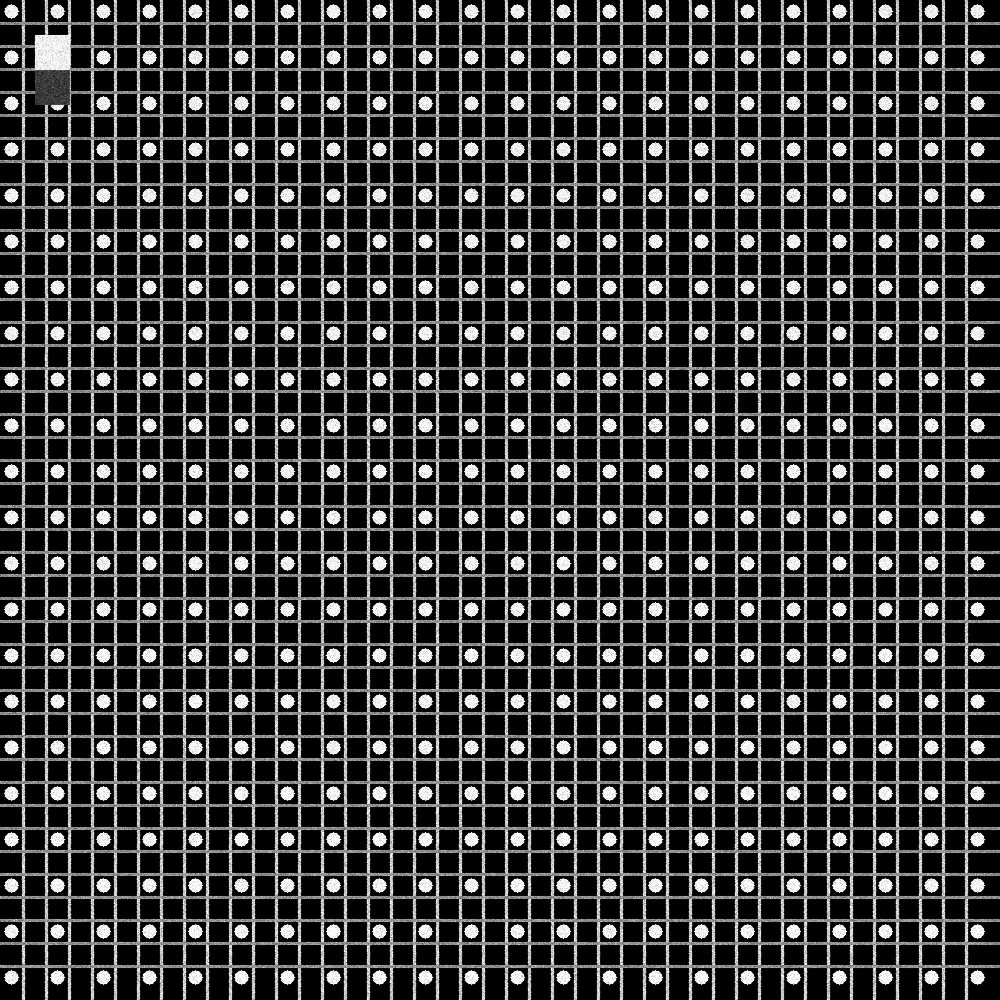
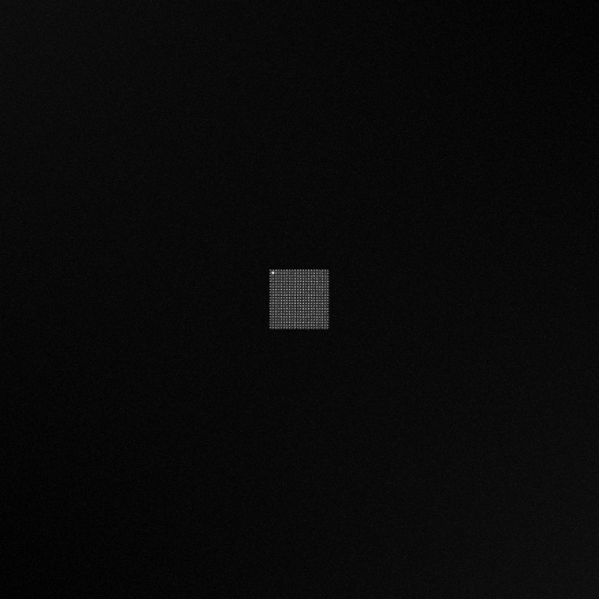
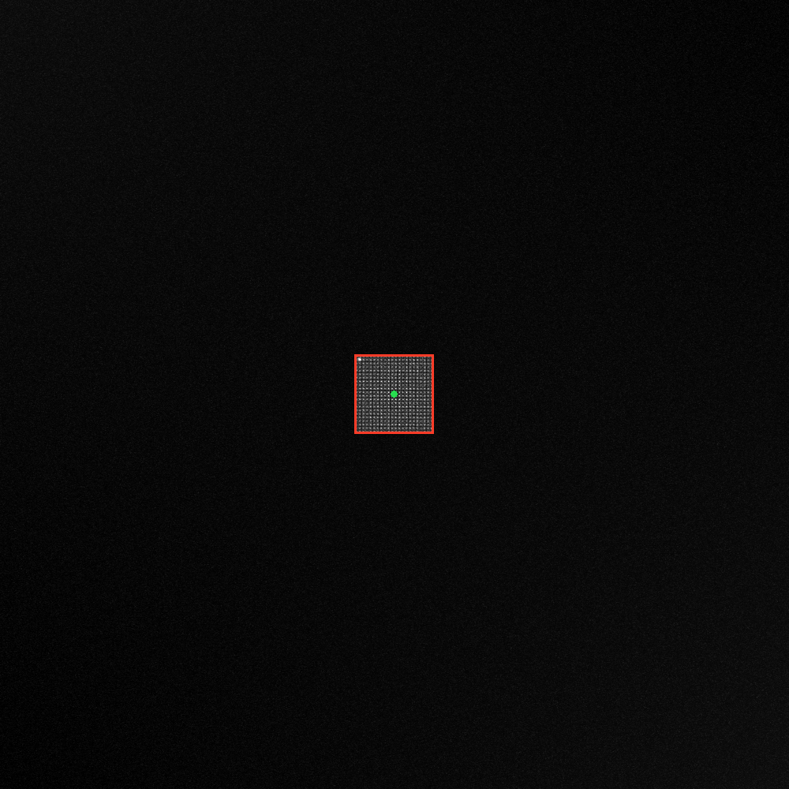
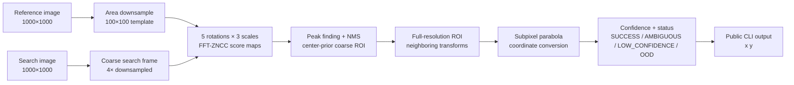

<div align="center">

# Drift-Sense: Deterministic Semiconductor Localization

**Recover a known inspection site after stage drift, without hiding periodic ambiguity.**

[](https://github.com/Maniteja8883/Drift-Sense/actions/workflows/ci.yml)
[](LICENSE)
[](docs/architecture.md)

<table>
<tr>
<td align="center"><b>Acc@1px</b><br><code>80.00%</code></td>
<td align="center"><b>Acc@5px</b><br><code>100.00%</code></td>
<td align="center"><b>Median error</b><br><code>0.513 px</code></td>
<td align="center"><b>P50 latency</b><br><code>86.14 ms</code></td>
<td align="center"><b>Tests</b><br><code>11 passed</code></td>
</tr>
</table>

</div>

## What this is

Drift-Sense localizes a high-resolution semiconductor reference inside a larger search image after small thermal or mechanical stage drift. It uses one deterministic classical pipeline—FFT-ZNCC, bounded geometry search, subpixel refinement, and explicit ambiguity diagnostics—so a reviewer can reproduce the result without model weights.

## Reproduce this in 60 seconds

This is the evaluator-facing smoke test. It prints exactly one coordinate pair and requires no manual path edits:

Prerequisite: Python 3.9 or newer.

```bash
git clone https://github.com/Maniteja8883/Drift-Sense.git
cd Drift-Sense
python -m venv venv
source venv/bin/activate                 # Windows: venv\Scripts\activate
pip install -r requirements.txt
python inference.py \
  --reference examples/reference.png \
  --search examples/search.png
# expected stdout: 499.5000 499.5000
```

The public API is intentionally small:

```text
input:  reference image path, search image path
output: x y
```

Diagnostics are available through `scripts/run_demo.py`; they are never printed by `inference.py` on stdout.

## Which command produces which output?

- Run [`inference.py`](inference.py) to execute the complete official localization pipeline. It is the evaluator-facing entry point and prints only the predicted center coordinates:

  ```bash
  python inference.py --reference examples/reference.png --search examples/search.png
  ```

  ```text
  499.5000 499.5000
  ```

- Run [`scripts/run_demo.py`](scripts/run_demo.py) to execute the same official pipeline with human-readable diagnostics. It reports the coordinates, score, heuristic confidence, status, and latency, and writes the annotated result to `examples/result.png`.

  ```bash
  python scripts/run_demo.py
  ```

`inference.py` is the command used for scoring; `scripts/run_demo.py` is the command used to understand and visualize a prediction. The demo is not a separate model or inference path.

## Result at a glance

The stored result is from 30 in-distribution synthetic pairs plus one separately reported periodic ambiguity case. It is not a claim of industrial SEM performance.

| Metric | Verified result |
|---|---:|
| Acc@1px | 80.00% |
| Acc@3px | 90.00% |
| Acc@5px | 100.00% |
| Median error | 0.513 px |
| P90 error | 2.611 px |
| P50/P90/P99/max latency | 86.14 / 90.71 / 108.45 / 109.10 ms |
| Statuses | 27 `SUCCESS`, 2 `LOW_CONFIDENCE`, 1 `AMBIGUOUS` |

The complete machine-readable artifact and baseline comparison are [`results/benchmark_30.json`](results/benchmark_30.json) and [`results/benchmark_30.csv`](results/benchmark_30.csv). The human-readable source of truth is [`results/benchmark_summary.md`](results/benchmark_summary.md).

## What the example images show

<div align="center">
<table>
<tr>
<td align="center"><br><sub>Reference: high-resolution site</sub></td>
<td align="center"><br><sub>Search: larger, lower-resolution frame</sub></td>
<td align="center"><br><sub>Result: red box and green predicted center</sub></td>
</tr>
</table>
</div>

The result image is an annotated full search frame, so the target is intentionally small at this scale. The numerical output is the authoritative evaluator artifact: `499.5000 499.5000`.

## Reproduce the full evidence package

For the judge-oriented, step-by-step procedure—including clean-environment verification, dataset generation, test execution, benchmark outputs, and arbitrary-working-directory inference—see [`docs/REPRODUCIBILITY.md`](docs/REPRODUCIBILITY.md).

### Generate independent test data

```bash
python dataset_generator.py \
  --architecture DRAM \
  --num-pairs 5 \
  --output-dir ./test_data \
  --seed 42
```

The output contains reference/search PNGs and `benchmark_ground_truth.csv` with `index`, `architecture`, `reference`, `search`, `gt_x`, and `gt_y`. The generator is independent of inference; `inference.py` never reads the CSV, filenames, or generator metadata.

### Run tests and benchmark

```bash
python -m pytest tests/ -v
python scripts/run_benchmark.py
```

The benchmark regenerates the deterministic `synthetic-v2` dataset, evaluates the official path and comparison baselines, and writes JSON, CSV, and Markdown artifacts under `results/`.

## Workflow



The diagram describes the official path; it does not imply a learned model or stage-level latency measurements. The benchmark latency is measured end-to-end around in-memory prediction, excluding image I/O.

## Why this approach

### Why not raw template matching?

A sliding template matcher answers the basic question, but it is vulnerable to brightness/contrast changes, gives integer-pixel peaks, and does not address rotation or scale. FFT-ZNCC keeps the correlation idea while normalizing local brightness and using FFT convolution to evaluate a large score map efficiently.

### Why not select the highest score unconditionally?

Periodic layouts can create several separated peaks with nearly identical scores. The engine uses non-maximum suppression, compares the peak margin, and reports `AMBIGUOUS` when separated near-equal candidates remain. Under the challenge’s near-center assumption, a documented center prior is used only as a near-tie/fallback heuristic.

### Why not make the neural implementation official?

The retained PyTorch stack has no verified checkpoint and no reproducible ML evidence on real labeled SEM data. The classical path is therefore the defensible submission path: no training step, no weight download, deterministic behavior, interpretable failures, and a small dependency surface. The neural code remains visible and explicitly experimental in [`experimental/ml/`](experimental/ml/).

## Official architecture

1. **Load and validate:** read 1000×1000 grayscale reference and search images.
2. **Match scales:** area-average the reference by 10× to create a 100×100 template in search-image pixels.
3. **Coarse localization:** downsample the search and template by 4× and evaluate FFT-ZNCC for five rotations (`−3°` to `+3°`) and three scales (`0.95×`, `1.0×`, `1.05×`).
4. **Select a region:** find local maxima, apply NMS, and use the center prior only where the configured score tie rule permits it.
5. **Fine localization:** search a full-resolution ROI over the neighboring transform candidates.
6. **Refine geometry:** fit bounded three-point parabolas around the winning correlation peak. For a 100×100 template, the center conversion is `top_left + (100−1)/2 = top_left + 49.5`.
7. **Report evidence:** return coordinates, score, heuristic confidence, ambiguity evidence, and status through the package API. The strict wrapper prints only coordinates.

Detailed responsibilities and evidence are in [`docs/architecture.md`](docs/architecture.md) and [`docs/WORKFLOW.md`](docs/WORKFLOW.md).

## Benchmark comparison

These are measured values from the committed CSV, not illustrative numbers. The baselines are intentionally diagnostic: they show what is gained by adding geometry and the final refinement/diagnostic path.

| Method | Acc@1px | Acc@5px | Median error | P90 error | P50 latency |
|---|---:|---:|---:|---:|---:|
| Naive single-scale FFT-ZNCC | 36.67% | 70.00% | 2.236 px | 111.231 px | 78.00 ms |
| FFT-ZNCC + center tie | 36.67% | 70.00% | 2.236 px | 111.231 px | 77.65 ms |
| FFT-ZNCC + geometric search | 0.00% | 93.33% | 2.828 px | 2.828 px | 43.23 ms |
| **Drift-Sense final** | **80.00%** | **100.00%** | **0.513 px** | **2.611 px** | **86.14 ms** |

The coarse geometric baseline is faster but returns coarse coordinates; the final path spends additional time on the full-resolution ROI and subpixel refinement. See [`results/benchmark_30.csv`](results/benchmark_30.csv) for the exact artifact.

## Verification status

- ✅ Fresh isolated environment installed the frozen `requirements.txt`.
- ✅ Public inference works from the repository root and from another current directory.
- ✅ Public stdout contains only two finite coordinate tokens.
- ✅ Dataset generator creates images and the required ground-truth CSV.
- ✅ 11 numerical and pipeline tests pass.
- ✅ Ruff and Python compilation checks pass.
- ✅ Benchmark artifacts include seed, dataset version, software, hardware, latency method, and Git metadata.
- ✅ Renamed-file leakage audit passed; inference does not inspect filenames or ground truth.

## Data, assumptions, and limitations

The benchmark uses a **physics-informed synthetic SEM corruption approximation**, not authentic or validated SEM noise. It includes Poisson shot-noise sampling, charging/edge approximations, smooth charging gradients, scanline jitter, and bounded geometric mismatch. See [`docs/benchmark_methodology.md`](docs/benchmark_methodology.md) and [`docs/references.md`](docs/references.md).

The center prior is a challenge-scoped assumption, not universal capability. Supported geometry is limited to the documented image sizes, ±3° rotation, and 0.95–1.05 scale. Confidence is a bounded heuristic—not a calibrated probability. Periodic layouts can remain genuinely ambiguous, and no real SEM tool-side validation is included. Full details are in [`docs/assumptions.md`](docs/assumptions.md) and [`docs/limitations.md`](docs/limitations.md).

## Repository map

```text
inference.py           evaluator-facing API: prints only x y
dataset_generator.py   standalone deterministic data generator
src/drift_sense/       official package and numerical core
baseline/              reusable FFT-ZNCC baseline
benchmark/             evaluation and artifact generation
scripts/               demo and canonical benchmark commands
tests/                 numerical and pipeline tests
examples/              reference, search, and annotated result images
results/               committed benchmark artifacts
docs/                  architecture, workflow, methodology, audits
experimental/ml/       retained PyTorch research implementation
```

## Documentation and references

- [`GETTING_STARTED.md`](GETTING_STARTED.md): short command card.
- [`docs/REPRODUCIBILITY.md`](docs/REPRODUCIBILITY.md): judge-facing verification procedure.
- [`docs/WORKFLOW.md`](docs/WORKFLOW.md): conceptual and implementation data flow.
- [`docs/architecture.md`](docs/architecture.md): official vs experimental components and evidence.
- [`docs/assumptions.md`](docs/assumptions.md): geometry and challenge assumptions.
- [`docs/limitations.md`](docs/limitations.md): known failure modes and scope boundaries.
- [`docs/references.md`](docs/references.md): stable citations for the technical choices.

## License

MIT; see [`LICENSE`](LICENSE).
