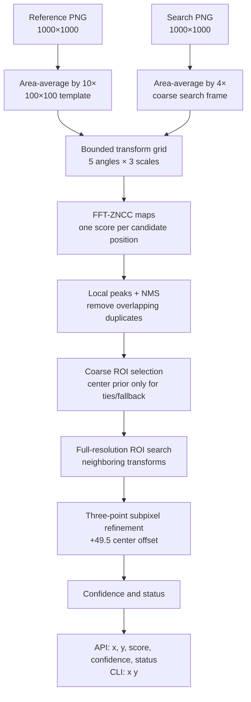

# Workflow: from two images to a coordinate

## Mental model

The task is like finding a small map inside a larger map when the camera has moved slightly. The reference is the small map; the search image is the larger frame. Drift-Sense first finds a promising neighborhood, then spends more computation only there.



## 1. Put both images in the same coordinate system

The reference is 1000×1000 pixels at the finer scale. The search frame is also 1000×1000 pixels, but represents a coarser physical field. Area averaging the reference by 10 produces a 100×100 template in search-image pixels. That conversion is geometry, not a learned parameter.

## 2. Build a correlation score map

For each possible template position, ZNCC compares the template with the corresponding search window after subtracting each window’s mean and normalizing its energy. This reduces sensitivity to additive brightness offsets and multiplicative contrast changes. FFT convolution computes the numerator efficiently; integral images provide the local sums and squared sums needed by the normalization.

The output is a 2-D score map. A high point means “visually similar here,” not “the answer is certainly here.” Multiple high points are evidence of ambiguity, especially in periodic layouts.

## 3. Search small geometry changes

The official grid tests five angles (`−3°`, `−1.5°`, `0°`, `+1.5°`, `+3°`) and three scales (`0.95`, `1.0`, `1.05`). The bounds reflect the challenge’s small-drift operating assumption. A larger mismatch is outside the supported envelope and should reduce confidence rather than be silently presented as solved.

## 4. Coarse-to-fine selection

The coarse pass is cheaper because both images are downsampled. It identifies a candidate center and a transform. The fine pass evaluates a full-resolution ROI around that candidate and its neighboring transforms. This avoids running the most expensive calculation over every possible full-resolution position.

## 5. Ambiguity and center prior

NMS retains separated local maxima. If the best and second-best peaks are close in score and far enough apart, the periodicity report marks the result `AMBIGUOUS`. A documented `(500, 500)` center prior is used only within the configured five-percent tie rule or when a weak remote coarse peak would otherwise make the fine ROI unreliable. It is a challenge-scoped assumption, not a general-purpose location prior.

## 6. Convert a peak to the requested center

Matching returns the template’s top-left position. For a 100×100 template, its pixel-center coordinate is:

```text
top_left + (template_size - 1) / 2
= top_left + (100 - 1) / 2
= top_left + 49.5
```

The conversion is tested numerically in `tests/test_geometry.py`.

## 7. Status policy

- `SUCCESS`: score and evidence are sufficient under the configured policy.
- `AMBIGUOUS`: separated near-equal peaks make more than one location plausible.
- `LOW_CONFIDENCE`: the best signal or combined heuristic evidence is weak.
- `OUT_OF_DISTRIBUTION`: the predicted center is outside the supported center radius.

The strict challenge wrapper still emits coordinates because its contract is coordinate-only. The richer package result exposes the evidence so a downstream controller can reject or review uncertain predictions.

## Evidence and reproduction

The numerical core is covered by [`tests/`](../tests/). The component-level evidence and reproduction commands are summarized in [`architecture.md`](architecture.md), while benchmark methodology and limitations are in [`benchmark_methodology.md`](benchmark_methodology.md) and [`limitations.md`](limitations.md).
